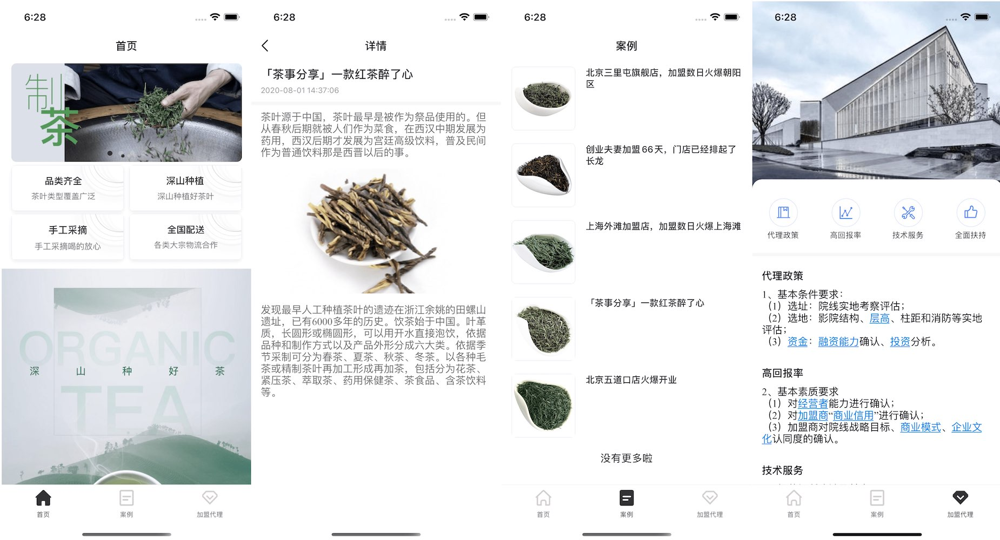

### 介绍

此源码为企业展示类型，主要功能包括企业信息展示、案例展示、加盟申请等。包含前后端，其中前端代码使用avm.js多端技术开发，可同时编译为Android & iOS App以及微信小程序；后端使用APICloud数据云3.0云函数自定义接口。

详细了解[avm多端开发技术](https://docs.apicloud.com/apicloud3?uzchannel=30)。

详细了解[数据云服务](https://docs.apicloud.com/Cloud-API/sentosa?uzchannel=30)。

### 效果图



### 源码目录结构介绍

目录结构延续widget代码包的目录结构，pages目录下用于创建符合avm.js语法规范的stml文件，stml文件可用于编译为App和小程序代码。

```js
|---widget             // widget代码根目录
|    |---components    // stml组件目录。该目录下stml文件仅被pages目录下页面引用，不单独编译
|    |---css		   // 外置引用的css文件存放目录
|    |---image         // 图片资源文件目录
|    |---pages         // stml页面代码文件目录。该目录中每个文件对应一个页面，将被编译为js或者小程序的3个代码片段
|       |---index      // stml页面代码文件子目录。如果您希望您的App能够兼容微信小程序，需按照微信小程序目录结构，新增一层子目录，并将stml文件置于该目录下
|    |---html          // 标准html页面代码文件目录
|    |---res           // res目录
|    |---script        // 外置引用的js文件存放目录
|    |---config.xml    // app配置文件
|
```

### 使用步骤

1. 使用[APICloud Studio 3](https://www.apicloud.com/studio3?uzchannel=30) 作为开发工具。
2. 下载本源码。
3. 在开发工具中新建项目，并将本源码导入新建的项目中，注意更新config.xml中的appid为你项目的appid。
4. 使用AppLoader进行真机同步调试预览。
5. 或者提交项目源码，并为当前项目云编译自定义Loader进行真机同步调试预览。
6. [云编译](https://www.apicloud.com/appoverview?uzchannel=30) 生成Android & iOS App以及微信小程序源码包。

### 联系我们

如果您在使用过程中遇到了问题，或者有更多的宝贵意见，欢迎到APICloud社区和QQ群与我们进行互动讨论。

官方技术交流群：339762594

官方社区：[https://community.apicloud.com/](https://community.apicloud.com/?uzchannel=30)

### 其它

感谢关注本项目，如果觉得对您有帮助，希望给个 star 鼓励一下。

如需进一步了解技术细节和实现，请参阅 docs 目录下的[《源码解析文档》](https://github.com/apicloudcom/company-display/tree/main/docs)。

## License

MIT © [APICloud](https://www.apicloud.com/?uzchannel=30)
